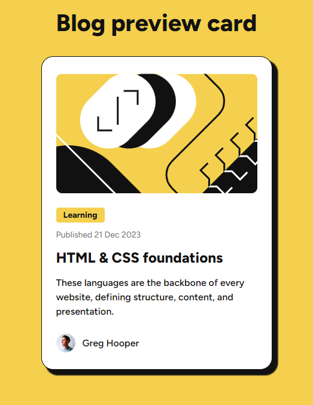

# Proyecto 02 - Solución de la Tarjeta de vista previa del blog

[](https://app.netlify.com/sites/lombardidev-blog-preview/deploys)

Esta es una solución al [desafío del componente de Tarjeta de vista previa del blog en Frontend Mentor](https://www.frontendmentor.io/challenges/blog-preview-card-ckPaj01IcS). Los desafíos de Frontend Mentor te ayudan a mejorar tus habilidades de codificación construyendo proyectos realistas.

## Tabla de contenidos

- [Descripción general](#descripción-general)
  - [Captura de pantalla](#captura-de-pantalla)
  - [Enlaces](#enlaces)
- [Mi proceso](#mi-proceso)
  - [Construido con](#construido-con)
  - [Lo que aprendí](#lo-que-aprendí)
  - [Desarrollo continuo](#desarrollo-continuo)
  - [Recursos útiles](#recursos-útiles)
- [Autor](#autor)
- [Agradecimientos](#agradecimientos)

## Descripción general

El desafío se basa en crear esta tarjeta de vista previa del blog y lograr que se parezca lo más posible al diseño. Se tiene libertad para usar cualquier herramienta que guste para ayudarte a completar el desafío. Así que, si hay algo que te gustaría practicar, no dudes en intentarlo.

### Captura de pantalla



### Enlaces

- URL de la solución: [URL de la solución de aquí](https://github.com/Lombardimn/Self-taught-React/tree/main/frontend30-projects/project-02)
- URL del sitio en vivo: [URL del sitio en vivo aquí](https://lombardidev-qr-component.netlify.app/)

## Mi proceso

El proyecto esta realizado con React con el objetivo de familiarizarme más con esta biblioteca. Primero, limpié todas las clases CSS predefinidas y eliminé los archivos innecesarios del proyecto base, comenzando así con un proyecto completamente limpio.

A continuación, enfoqué mi trabajo en estilizar el `html`y el `body` para establecer una base de diseño coherente. Posteriormente, estructuré la página principal, que se compone de un título y el componente Card, el cual definí de manera separada para mantener un código modular y fácil de mantener.

Base el diseño de la estructura en componentes. El componente `Card`, componente padre que define el contenido básico, creando una estructura con un `container` y un `content`. Este ultimo da los estilos necesarios para el `children` y el componente `Profile`. La `Card` recibe props como la imagen y el texto alternativo, el titulo y la descripción, que se utilizan para complementar la información.

El componente `Profile`, no recibe props dado la utilidad de este proyecto. Pero se podria adaptar o mejorar para que maneje informacion dependiendo el entorno.

Finalmente, enfoqué el estilado en una estrategia **mobile-first**, asegurándome de que la vista en dispositivos móviles fuera óptima, y luego lo adapté para pantallas de escritorio.

Código del componente:

```tsx
import { Card } from "./components/Card/Card"
import "./app.css"

function App() {

  return (
    <>
      <h1>Blog preview card</h1>
      <Card 
        image="/images/illustration-article.svg" 
        imgAlt="Ilustration article"
        activity="Learning"
        published="Published 21 Dec 2023"
      >
        <h2 className="card-title">HTML & CSS foundations</h2>
        <p className="card-description">These languages are the backbone of every website, defining structure, content, and presentation.</p>
      </Card>
    </>
  )
}

export default App
```	

```tsx
import { Profile } from "../Profile/Profile"
import "./card.css"

interface Props {
  children: React.ReactNode
  image: string
  imgAlt: string
  activity?: string
  published?: string
}

const Card = ( { children, image, imgAlt, activity, published }: Props) => {
  return (
    <div className="container">
      <div className="image">
        
      </div>
      <div className="content">
        <div className="header-card">
          <div className="activity">{activity}</div>
          <div className="published">{published}</div>
        </div>
        {children}
      </div>
      <Profile />
    </div>
  )
}

export { Card }
```

```tsx
import "./profile.css"

const Profile = () => {
  return (
    <div className="profile">
      
      <span>Greg Hooper</span>
    </div>
  )
}

export { Profile }
```

### Construido con

- [VSCode](https://code.visualstudio.com/)
- [Figma](https://www.figma.com/)
- [Vite](https://vitejs.dev/)
- [React](https://reactjs.org/) - Librería JS
- [Next.js](https://nextjs.org/) - Framework de React
- Propiedades personalizadas de CSS
- Flexbox
- Flujo de trabajo mobile-first

### Lo que aprendí

En este proyecto con React, aplique varios conceptos claves que me permitieron mejorar tanto mi flujo de trabajo como mis habilidades de desarrollo. Inicié el proyecto desde cero, limpiando todo el template y las clases CSS predefinidas para trabajar con una estructura completamente limpia, lo que me permitió tener un control total sobre el código y evitar archivos innecesarios.

Uno de los aspectos más importantes fue la creación de componentes reutilizables, como el componente `Card`, que desarrollé de manera modular y flexible. Este componente recibe `props`, lo que me permitió profundizar en el uso de `props` para hacer que los componentes sean dinámicos y adaptables según el contexto en el que se usen.

Además, estructuré la aplicación con una clara separación entre la lógica y los estilos. Definí la estructura principal con un título y el componente `Card`, aplicando una organización que mantiene el código limpio y fácil de mantener. El diseño lo abordé con una estrategia mobile-first, asegurándome de que el proyecto se viera bien en dispositivos móviles antes de adaptar los estilos para pantallas más grandes, lo cual es fundamental en el desarrollo web actual.

Por último, utilicé CSS de manera modular, asociando estilos directamente a componentes específicos para evitar conflictos globales y sobrescritura de estilos. Esta experiencia me permitió afianzar mis conocimientos sobre diseño responsivo y modularización de componentes, lo que sin duda me será útil en futuros proyectos.

### Desarrollo continuo

En mi camino de aprendizaje con React, tengo la intención de profundizar en temas más complejos que me permitan crear aplicaciones más robustas y dinámicas. Uno de mis objetivos es trabajar con componentes más inteligentes, que no solo sean reutilizables, sino que también gestionen su propio estado interno. Esto me permitirá implementar funcionalidades más avanzadas, como la manipulación de datos en tiempo real y la interacción más efectiva con el usuario.

Además, me gustaría explorar el manejo del ciclo de vida de los componentes, lo cual es fundamental para optimizar el rendimiento de las aplicaciones. Aprender a utilizar hooks como `useEffect` me permitirá gestionar efectos secundarios de manera más eficiente, facilitando tareas como la obtención de datos de APIs y la sincronización con el estado.

Otro aspecto que quiero abordar es el manejo del renderizado condicional y el uso de context API para el manejo de estado global. Esto me ayudará a crear aplicaciones más escalables, donde varios componentes puedan acceder y actualizar el mismo estado sin necesidad de pasar props de forma excesiva.

Asimismo, me interesa implementar pruebas unitarias y de integración con herramientas como Jest y React Testing Library, lo que me permitirá asegurar la calidad y fiabilidad del código a medida que mi aplicación crezca.

Por último, también quiero familiarizarme con el uso de TypeScript en mis proyectos de React, ya que esto me proporcionará un sistema de tipos que mejorará la mantenibilidad y la detección temprana de errores en el desarrollo.

Estos son solo algunos de los temas que planeo explorar para continuar desarrollando mis habilidades en React y mejorar mi capacidad para construir aplicaciones web complejas y eficientes.

### Recursos útiles

- [React Learn](https://react.dev/learn) - Documentación oficial

Esta fuente de documentación oficial, es clara y consistente, lo que me permite aprender más sobre React y sus propiedades. Cada vez que necesites ayuda, puedes visitar esta fuente de documentación y aprender más sobre React.


## Autor

- [@lombardidev](https://lombardidev.ar/)
- [@SofiaBargues](https://github.com/SofiaBargues)
- [@Frontend Mentor](https://www.frontendmentor.io)
- [@Frontend 30 Projects](https://frontend-30.vercel.app/)

## Agradecimientos

Quiero expresar mi agradecimiento especial a [@SofiaBargues](https://github.com/SofiaBargues) por su dedicación y esfuerzo en preparar el proyecto Frontend 30 para la comunidad. Su trabajo ha sido una fuente de inspiración y un recurso invaluable que ha facilitado el aprendizaje y el desarrollo de habilidades en el ámbito del desarrollo front-end. Gracias a su contribución, muchos de nosotros podemos  seguir mejorando nuestras habilidades y avanzar en nuestros proyectos de manera significativa. ¡Gracias, Sofía!