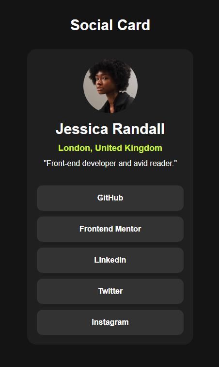

# Proyecto 02 - Solución del Perfil Social

[](https://app.netlify.com/sites/lombardidev-social-card/deploys)

Esta es una solución al [desafío del componente Perfil Social del blog en Frontend Mentor](https://www.frontendmentor.io/challenges/social-links-profile-UG32l9m6dQ). Los desafíos de Frontend Mentor te ayudan a mejorar tus habilidades de codificación construyendo proyectos realistas.

## Tabla de contenidos

- [Descripción general](#descripción-general)
  - [Captura de pantalla](#captura-de-pantalla)
  - [Enlaces](#enlaces)
- [Mi proceso](#mi-proceso)
  - [Construido con](#construido-con)
  - [Lo que aprendí](#lo-que-aprendí)
  - [Desarrollo continuo](#desarrollo-continuo)
  - [Recursos útiles](#recursos-útiles)
- [Autor](#autor)
- [Agradecimientos](#agradecimientos)

## Descripción general

El desafío se basa en crear esta tarjeta de un perfil para compartir enlaces en redes sociales. ¡Incluso puedes personalizarlo y usarlo para compartir todos tus perfiles sociales!. Se tiene libertad para usar cualquier herramienta que guste para ayudarte a completar el desafío. Así que, si hay algo que te gustaría practicar, no dudes en intentarlo.

### Captura de pantalla



### Enlaces

- URL de la solución: [URL de la solución de aquí](https://github.com/Lombardimn/Self-taught-React/tree/main/frontend30-projects/project-03)
- URL del sitio en vivo: [URL del sitio en vivo aquí](https://lombardidev-social-card.netlify.app/)

## Mi proceso

El proyecto esta realizado con React con el objetivo de familiarizarme más con esta biblioteca.

Estructuré el proyecto mediante una aplicación modular, que se compone de un título y el componente Card, el cual definí de manera separada para mantener un código limpio y fácil de mantener.

El componente `Card`, componente padre que define el contenido básico, creando una estructura con un `container` y un `content`. Este ultimo da los estilos necesarios para el `children` y el componente `Profile`. El `Children` se compone de un componente `Profile` y otro llamado `CallToAction` quien recibe props que se utilizan para complementar la información.

El componente `Profile`, no recibe props dado la utilidad de este proyecto. Pero se podria adaptar o mejorar para que maneje informacion dependiendo el entorno.

Aplique estilos CSS de manera modular, asociando estilos directamente a componentes específicos para evitar conflictos globales y sobrescritura de estilos. Por otra parte inclui el uso de asignación de constantes para las imagenes.

Finalmente, enfoqué el estilado en una estrategia **mobile-first**, asegurándome de que la vista en dispositivos móviles fuera óptima, y luego lo adapté para pantallas de escritorio.

Código del componente:

```tsx
import './App.css'
import { Card } from './assets/components/Card/Card'

function App() {
  return (
    <main>
      <h1>Social Card</h1>
      <Card />
    </main>
  )
}

export default App
```	

```tsx
import { Profile } from "../Profile/Profile"
import { CallToAction } from "../CallToAction/CallToAtion"
import './card.css'

const Card = () => {
  return (
    <div className="container">
      <Profile />
      <div className="content">
        <CallToAction href="#" rel="noopener noreferrer" >
          GitHub
        </CallToAction>
        <CallToAction href="#" rel="noopener noreferrer" >
          Frontend Mentor
        </CallToAction>
        <CallToAction href="#" rel="noopener noreferrer" >
          Linkedin
        </CallToAction>
        <CallToAction href="#" rel="noopener noreferrer" >
          Twitter
        </CallToAction>
        <CallToAction href="#" rel="noopener noreferrer" >
          Instagram
        </CallToAction>
      </div>
    </div>
  )
}

export { Card }
```

```tsx
import './profile.css'
import avatar from '../../../../public/images/avatar-jessica.jpeg'

const Profile = () => {
  return (
    <div className="profile">
      
      <div className="profile-info">
        <h2>Jessica Randall</h2>
        <h3>London, United Kingdom</h3>
        <p>"Front-end developer and avid reader."</p>
      </div>
    </div>
  )
}

export { Profile }
```


```tsx
import './callToAction.css'

interface Props {
  href: string | '#';
  target?: string
  rel?: string
  children?: React.ReactNode
}

const CallToAction = ({ href, target, rel, children } : Props) => {
  return (
    <a
      href={href}
      target={target}
      rel={rel}
      className='cto'
    >
      {children}
    </a>
  )
}

export { CallToAction }
```	

### Construido con

- [VSCode](https://code.visualstudio.com/)
- [Figma](https://www.figma.com/)
- [Vite](https://vitejs.dev/)
- [React](https://reactjs.org/) - Librería JS
- [Next.js](https://nextjs.org/) - Framework de React
- Propiedades personalizadas de CSS
- Flexbox
- Flujo de trabajo mobile-first

### Lo que aprendí

En este proyecto, he reforzado mis habilidades en `React`, especialmente en la creación y composición de componentes reutilizables. 

Al desglosar la funcionalidad en componentes pequeños como `Card`, `Profile` y `CallToAction`, logré un código más modular y mantenible. También aprendí a utilizar props de manera efectiva, permitiendo que cada componente sea adaptable y flexible. 

La organización del `CSS` para cada componente ha sido clave para mantener el diseño limpio y evitar conflictos de estilos. 

Además, el uso de interfaces en `TypeScript` ha mejorado la robustez del código, asegurando que las propiedades pasadas sean del tipo correcto. Este proyecto también me permitió practicar el enfoque `mobile-first` en CSS, asegurando que el diseño se adapte correctamente a diferentes pantallas. Trabajar con imágenes locales y manejarlas dentro de React también ha sido una lección valiosa, ya que aprendí a optimizar rutas y recursos. 

En general, este proyecto fortaleció mis habilidades en React y TypeScript, así como en la gestión de componentes y el flujo de datos.

### Desarrollo continuo

A futuro, veo la posibilidad de mejorar este proyecto integrando nuevas funcionalidades, como la adición de temas oscuros y claros mediante un sistema de preferencias del usuario o almacenamiento local. 

También planeo explorar la implementación de pruebas unitarias para cada componente utilizando frameworks como Jest o Testing Library, para garantizar que cada parte del código se comporte según lo esperado. 

En cuanto al diseño, podría aplicar más técnicas avanzadas de CSS como animaciones o transiciones suaves, para mejorar la experiencia de usuario. 

Otro aspecto interesante a explorar sería el manejo de datos dinámicos, utilizando una API externa para generar perfiles reales y redes sociales, lo que agregaría una capa más interactiva y realista a la tarjeta.

### Recursos útiles

- [React Learn](https://react.dev/learn) - Documentación oficial

Esta fuente de documentación oficial, es clara y consistente, lo que me permite aprender más sobre React y sus propiedades. Cada vez que necesites ayuda, puedes visitar esta fuente de documentación y aprender más sobre React.


## Autor

- [@lombardidev](https://lombardidev.ar/)
- [@SofiaBargues](https://github.com/SofiaBargues)
- [@Frontend Mentor](https://www.frontendmentor.io)
- [@Frontend 30 Projects](https://frontend-30.vercel.app/)

## Agradecimientos

Quiero expresar mi agradecimiento especial a [@SofiaBargues](https://github.com/SofiaBargues) por su dedicación y esfuerzo en preparar el proyecto Frontend 30 para la comunidad. Su trabajo ha sido una fuente de inspiración y un recurso invaluable que ha facilitado el aprendizaje y el desarrollo de habilidades en el ámbito del desarrollo front-end. Gracias a su contribución, muchos de nosotros podemos  seguir mejorando nuestras habilidades y avanzar en nuestros proyectos de manera significativa. ¡Gracias, Sofía!